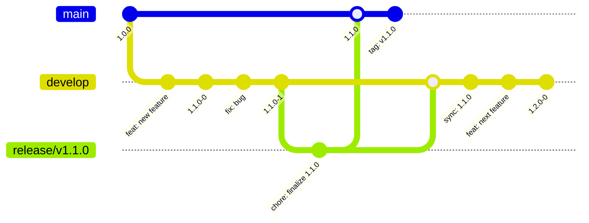
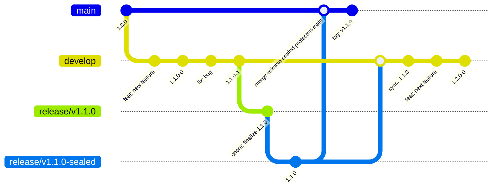
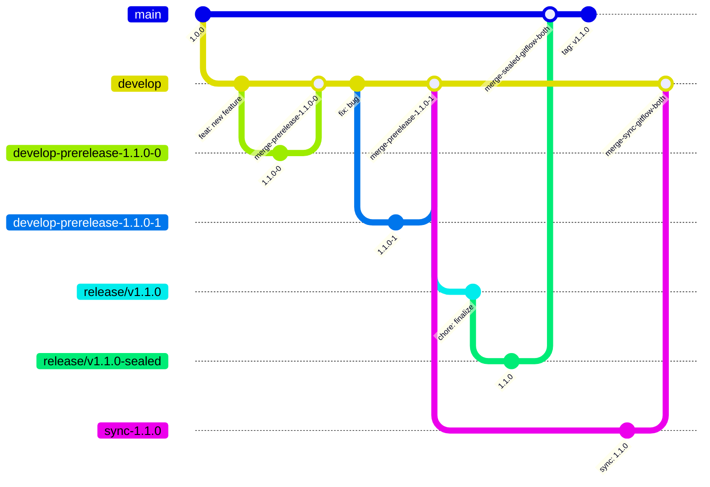
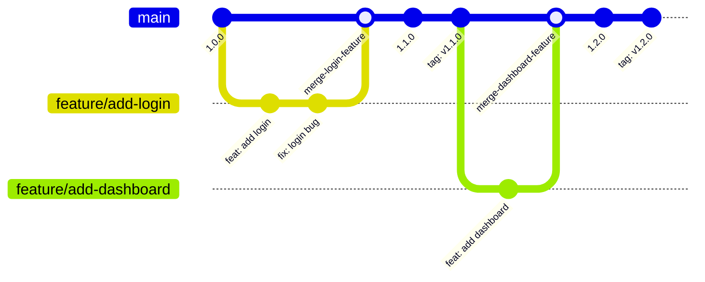
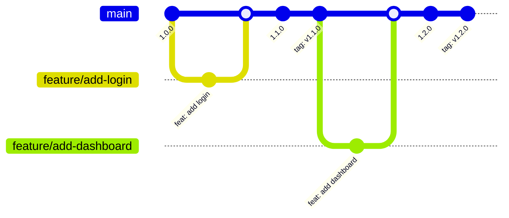
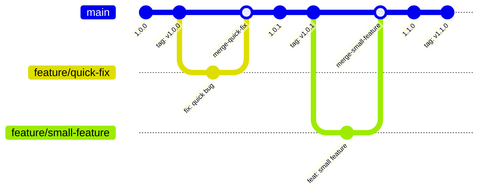
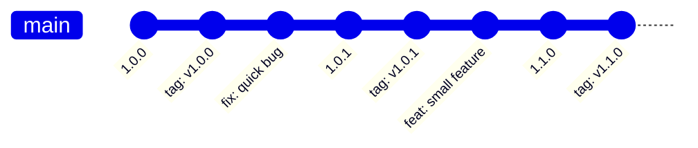
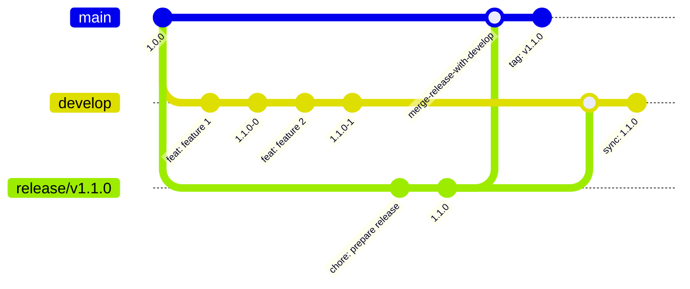
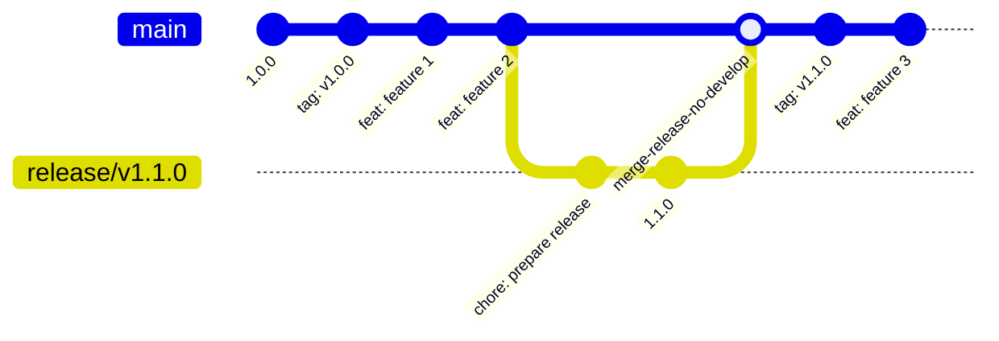
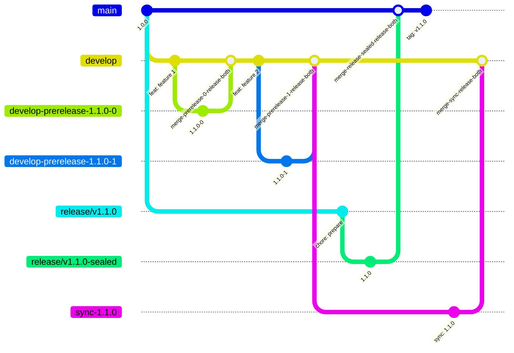

# Branching and Versioning Patterns in Git-Based Projects

This document catalogs the common branching and versioning patterns used in git-based software projects. Understanding these patterns will help design a declarative configuration model for action-version.

## Understanding the Commit Graphs

The commit graphs below use Mermaid syntax to visualize:

- **Branches**: Horizontal lines representing different branches
- **Commits**: Circles on branches with commit messages/version numbers
- **Merges**: Dotted lines showing merge relationships
- **Tags**: Commits labeled "tag: vX.Y.Z"
- **Version commits**: Commits that update package.json version (shown as version numbers)

### Key Differences: Protected vs Unprotected Branches

**Protected Branches:**

- Cannot commit directly to the branch
- Version changes must be made on separate branches
- PRs must be created to merge version changes back
- Creates additional branches like `release/v1.1.0-sealed`, `sync-1.1.0`, etc.
- More complex graph with PR merge commits

**Unprotected Branches:**

- Can commit version changes directly
- Simpler graph with direct commits
- No PR merge commits needed
- Version changes appear as direct commits on the branch

## Common Branching Patterns

### 1. Git Flow (Vincent Driessen)

**Branch Structure:**

- `main` / `master`: Production-ready code
- `develop`: Integration branch for features
- `release/*`: Preparing new releases
- `feature/*`: New features
- `hotfix/*`: Critical production fixes

**Versioning Strategy:**

- `develop`: Prerelease versions (e.g., `1.2.0-0`, `1.2.0-1`)
- `release/*`: Finalize prerelease to stable version (e.g., `1.2.0-0` → `1.2.0`)
- `main`: Stable release versions
- Tags: Created on `main` for each release

**Characteristics:**

- Long-lived `develop` branch
- Release branches are temporary
- Strict separation between development and production

**Commit Graph (Unprotected Branches):**



**Commit Graph (Protected main, Unprotected develop):**



**Commit Graph (Both Protected):**



### 2. GitHub Flow

**Branch Structure:**

- `main`: Production branch (protected)
- `feature/*`: Feature branches (merged to main)

**Versioning Strategy:**

- `main`: Stable versions based on tags
- Feature branches: No versioning (merged without version changes)
- Tags: Created on `main` commits

**Characteristics:**

- Simple, linear workflow
- No long-lived development branch
- Deploy from `main` frequently

**Commit Graph (Protected main):**



**Commit Graph (Unprotected main - rare but possible):**



### 3. Trunk-Based Development

**Branch Structure:**

- `main` / `trunk`: Single branch for all work
- Short-lived feature branches (hours/days)

**Versioning Strategy:**

- `main`: Versions incremented on each merge
- Tags: Created on `main` for releases

**Characteristics:**

- Minimal branching
- Continuous integration
- Feature flags for incomplete work

**Commit Graph (Protected main):**



**Commit Graph (Unprotected main):**



### 4. Release Branch Pattern

**Branch Structure:**

- `main`: Production branch
- `release/*`: Prepare releases
- `develop`: Optional development branch

**Versioning Strategy:**

- `main`: Stable versions
- `release/*`: Version sealing/finalization
- `develop`: Optional prerelease versions

**Characteristics:**

- Release branches branch from main
- Stabilization period before release
- Can work with or without develop branch

**Commit Graph (With develop, Protected main):**



**Commit Graph (Without develop, Protected main):**



**Commit Graph (Both Protected):**



### 5. GitLab Flow (Environment Branches)

**Branch Structure:**

- `main`: Production
- `pre-production`: Staging
- `production`: Live (optional, can deploy from main)
- `feature/*`: Features

**Versioning Strategy:**

- Environment-specific versioning
- Promotion through environments

**Characteristics:**

- Environment-based branching
- Upstream first rule
- Merge/pull requests between environments

**Commit Graph (All Protected):**

```mermaid
gitGraph
    commit id: "1.0.0"
    branch pre-production
    commit id: "feat: new feature"
    branch feature/add-feature
    checkout feature/add-feature
    commit id: "feat: add feature"
    checkout main
    merge feature/add-feature id: "merge-feature-gitlab"
    commit id: "1.1.0"
    checkout pre-production
    merge main id: "merge-main-to-preprod"
    commit id: "1.1.0-staging"
    branch production
    checkout production
    merge pre-production id: "merge-preprod-to-prod"
    commit id: "1.1.0-prod"
    commit id: "tag: v1.1.0"
```

**Commit Graph (Unprotected, Direct Promotion):**

```mermaid
gitGraph
    commit id: "1.0.0"
    commit id: "tag: v1.0.0"
    commit id: "feat: new feature"
    branch feature/add-feature
    checkout feature/add-feature
    commit id: "feat: add feature"
    checkout main
    merge feature/add-feature
    commit id: "1.1.0"
    branch pre-production
    checkout pre-production
    merge main
    commit id: "1.1.0-staging"
    branch production
    checkout production
    merge pre-production
    commit id: "1.1.0-prod"
    commit id: "tag: v1.1.0"
```

## Versioning Strategies

### Prerelease Versions

- **When**: During active development
- **Format**: `MAJOR.MINOR.PATCH-PRERELEASE` (e.g., `1.2.0-0`, `1.2.0-beta.1`)
- **Purpose**: Distinguish development versions from stable releases
- **Finalization**: Convert to stable by removing prerelease suffix

### Release Versions

- **When**: Production-ready code
- **Format**: `MAJOR.MINOR.PATCH` (e.g., `1.2.0`)
- **Purpose**: Stable, production releases
- **Tagging**: Typically tagged in git

### Semantic Versioning (SemVer)

- **Major**: Breaking changes (`1.0.0` → `2.0.0`)
- **Minor**: New features, backward compatible (`1.0.0` → `1.1.0`)
- **Patch**: Bug fixes, backward compatible (`1.0.0` → `1.0.1`)

## Common Configuration Patterns

### Pattern: Git Flow with Prereleases

```yaml
branches:
  main:
    version_strategy: stable
    tag_versions: true
  develop:
    version_strategy: prerelease
    base: main
    tag_prereleases: true
  release/*:
    version_strategy: finalize
    base: main
    create_branch: true
```

### Pattern: Simple Release Branches

```yaml
branches:
  main:
    version_strategy: stable
    tag_versions: true
  release/*:
    version_strategy: stable
    base: main
    create_branch: true
```

### Pattern: Trunk-Based

```yaml
branches:
  main:
    version_strategy: stable
    tag_versions: true
```

### Pattern: GitHub Flow

```yaml
branches:
  main:
    version_strategy: stable
    tag_versions: true
    protected: true
  feature/*:
    # No versioning, merged without version changes
```

## Key Concepts to Model

1. **Branch Roles**

   - Production branch (main/master)
   - Development branch (develop)
   - Release branches (release/\*)
   - Feature branches (feature/\*, optional)
   - Hotfix branches (hotfix/\*, optional)

2. **Version Strategies**

   - Stable releases (semver increments)
   - Prerelease versions (with prerelease suffix)
   - Version finalization (prerelease → stable)
   - Version synchronization (sync between branches)

3. **Branch Protection**

   - Protected branches (require PRs)
   - Unprotected branches (can commit directly)

4. **Tagging Strategies**

   - Tag all releases
   - Tag prereleases
   - Tag only major versions
   - No tagging

5. **Merge/Pull Request Patterns**

   - Direct commits (for unprotected branches)
   - Create PRs (for protected branches)
   - Automatic PR creation from version branches

6. **Version Synchronization**
   - Sync from main to develop after release
   - Sync from develop to feature branches
   - No synchronization

## Configuration Abstraction Goals

Instead of specifying low-level strategies (`pre-release`, `apply-bump`, `do-nothing`), users should describe:

1. **Their branching model** (Git Flow, GitHub Flow, Trunk-Based, etc.)
2. **Branch roles** (which branch is production, development, releases)
3. **Versioning behavior** (when to create prereleases, when to finalize, when to tag)
4. **Branch protection** (which branches require PRs vs direct commits)

The action should then infer:

- Which version strategy to use
- Whether to create branches
- What cleanup strategy to apply
- Whether to create PRs
- Tagging behavior

## Proposed Declarative Configuration Model

### Pattern-Based Configuration

Instead of:

```yaml
strategy: pre-release
base: main
branch: develop
create_branch: false
tag_prereleases: true
```

Users would describe:

```yaml
pattern: gitflow # or 'github-flow', 'trunk-based', 'release-branches', 'custom'

# Git Flow pattern would infer:
# - develop: prerelease versions, compare to main
# - release/*: finalize prerelease, create branch, PR to main
# - main: stable versions, tag releases
# - develop syncs from main after releases
```

### Custom Pattern Configuration

For custom patterns or fine-tuning:

```yaml
branches:
  main:
    role: production
    versioning:
      strategy: stable
      base: null # No base comparison needed for production
    tags: true
    protected: true # Requires PRs

  develop:
    role: development
    versioning:
      strategy: prerelease
      base: main
    tags: true
    protected: false # Can commit directly
    sync_from: main # After main releases, sync version

  release/*:
    role: release
    versioning:
      strategy: finalize # Convert prerelease to stable
      base: main
    protected: true
    create_pr: main # Create PR to main after version sealing
```

### Benefits

1. **Intuitive**: Describes what you want, not how to do it
2. **Consistent**: Pattern ensures all related settings work together
3. **Maintainable**: Changes to pattern affect all related branches
4. **Extensible**: Can still override specific behaviors when needed
5. **Self-documenting**: Configuration clearly shows the branching model

### Implementation Strategy

1. Define pattern presets (gitflow, github-flow, trunk-based, etc.)
2. Allow pattern + overrides for customization
3. Map pattern → low-level strategy configuration
4. Support both pattern-based and low-level configuration (backwards compatible)
