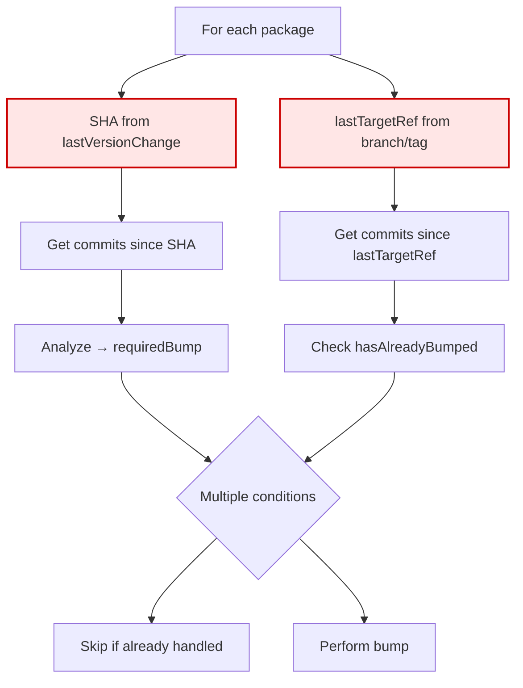
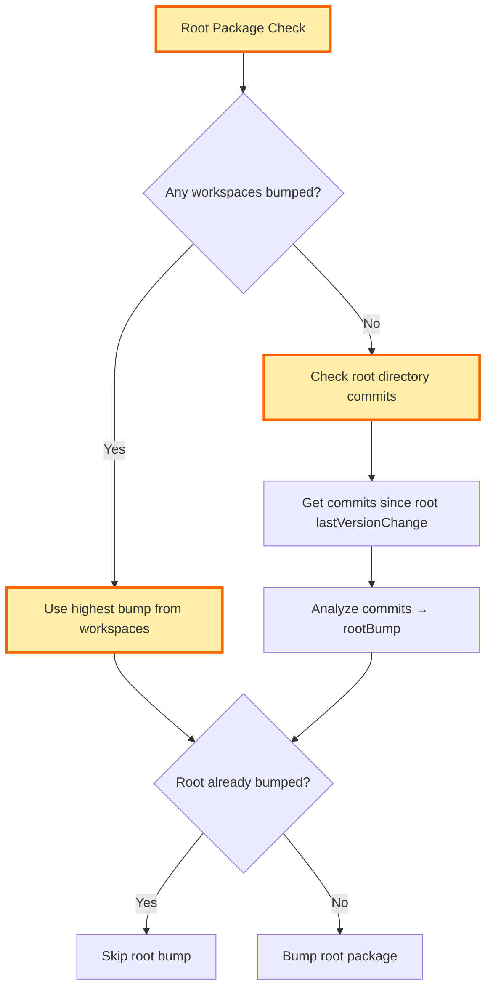

# Version Bump Discovery Logic - Flowchart

## Overview
This flowchart shows the complex decision tree used to determine if and how to bump package versions in the monorepo action.

## Main Flow

```mermaid
flowchart TD
    Start([Start Action]) --> Setup[Setup: Read inputs, configure git]
    Setup --> RefStrategy{Branch Target Provided?}
    
    %% Reference Point Strategy
    RefStrategy -->|Yes| BranchRef[lastTargetRef = lastNonMergeCommit from target branch]
    RefStrategy -->|No| TagRef[lastTargetRef = latest git tag]
    
    BranchRef --> Discovery
    TagRef --> Discovery
    
    %% Package Discovery
    Discovery[Discover packages & build dependency graph] --> TopoSort[Topological sort packages]
    TopoSort --> PackageLoop{For each package in order}
    
    %% Per-Package Logic
    PackageLoop --> PkgStart[Package: Get package.json path]
    PkgStart --> LastVersionChange[Find lastVersionChange SHA]
    
    %% LastVersionChange Strategy (Complex!)
    LastVersionChange --> Strategy1{Try: git log -L version.*X.Y.Z}
    Strategy1 -->|Found| StrategySuccess[SHA found - Strategy: 'version number']
    Strategy1 -->|Not Found| Strategy2{Try: git log -L version:}
    Strategy2 -->|Found| StrategySuccess2[SHA found - Strategy: 'version key']
    Strategy2 -->|Not Found| Strategy3{Try: git log file creation}
    Strategy3 -->|Found| StrategySuccess3[SHA found - Strategy: 'package file']
    Strategy3 -->|Not Found| StrategyError[ERROR: Cannot establish base commit]
    
    StrategySuccess --> GetCommits
    StrategySuccess2 --> GetCommits
    StrategySuccess3 --> GetCommits
    
    %% Commit Analysis
    GetCommits[Get commits affecting package since SHA] --> RequiredBump[Analyze commits → requiredBump]
    
    %% Skip Condition 1: Already Bumped Priority
    RequiredBump --> PriorityCheck{Package already bumped with higher priority?}
    PriorityCheck -->|Yes| SkipPriority[Skip: Record current version]
    PriorityCheck -->|No| DuplicateCheck
    
    %% Skip Condition 2: Already Bumped Detection
    DuplicateCheck[Get commits since lastTargetRef] --> AlreadyBumpedCheck{hasAlreadyBumped?}
    AlreadyBumpedCheck -->|Yes| SkipAlreadyBumped[Skip: Already bumped]
    AlreadyBumpedCheck -->|No| NoChangesCheck
    
    %% Skip Condition 3: No Changes
    NoChangesCheck{requiredBump = patch AND commits.length = 0?}
    NoChangesCheck -->|Yes| SkipNoChanges[Skip: No changes]
    NoChangesCheck -->|No| DoBump
    
    %% Actual Bump
    DoBump[Bump version & commit] --> UpdateDeps[Update dependent packages]
    UpdateDeps --> NextPackage{More packages?}
    
    %% Skip paths
    SkipPriority --> NextPackage
    SkipAlreadyBumped --> NextPackage
    SkipNoChanges --> NextPackage
    
    %% Continue or Root
    NextPackage -->|Yes| PackageLoop
    NextPackage -->|No| RootCheck{Root package workspaces?}
    
    %% Root Package Logic
    RootCheck -->|Yes| RootBumpLogic[Complex root bump logic]
    RootCheck -->|No| TestFailures
    
    RootBumpLogic --> RootStrategy{Any workspaces bumped?}
    RootStrategy -->|Yes| RootAggregate[Use most significant bump from workspaces]
    RootStrategy -->|No| RootCommits[Check root commits directly]
    
    RootAggregate --> RootAlreadyBumped{Root already bumped?}
    RootCommits --> RootAnalyze[Analyze root commits → rootBump]
    RootAnalyze --> RootAlreadyBumped
    
    RootAlreadyBumped -->|Yes| TestFailures
    RootAlreadyBumped -->|No| RootBump[Bump root version]
    RootBump --> TestFailures
    
    %% Final Steps
    TestFailures{Any test failures?} -->|Yes| Fail[FAIL: Test failures]
    TestFailures -->|No| Success[SUCCESS: Push changes]
    
    %% Error paths
    StrategyError --> Fail

    %% Styling
    classDef complexLogic fill:#ffeeaa,stroke:#ff6600,stroke-width:3px
    classDef skipCondition fill:#ffe6e6,stroke:#cc0000,stroke-width:2px
    classDef strategy fill:#e6f3ff,stroke:#0066cc,stroke-width:2px
    
    class LastVersionChange,RootBumpLogic complexLogic
    class PriorityCheck,AlreadyBumpedCheck,NoChangesCheck skipCondition
    class Strategy1,Strategy2,Strategy3 strategy
```



## Detailed Analysis of Complex Areas

### 1. LastVersionChange Strategy (Lines 180-203)

The action uses **3 fallback strategies** to find when a version was last changed:

```mermaid
flowchart TD
    A[lastVersionChange function] --> B{Strategy 1: Search for exact version number}
    B --> B1[git log -L '/version.*1\.2\.3.*"/package.json']
    B1 --> B2{Found commit?}
    B2 -->|Yes| Success1[Return SHA - Strategy: 'version number']
    B2 -->|No| C{Strategy 2: Search for any version change}
    
    C --> C1[git log -L '/version/package.json']
    C1 --> C2{Found commit?}
    C2 -->|Yes| Success2[Return SHA - Strategy: 'version key']
    C2 -->|No| D{Strategy 3: File creation}
    
    D --> D1[git log package.json creation]
    D1 --> D2{Found commit?}
    D2 -->|Yes| Success3[Return SHA - Strategy: 'package file']
    D2 -->|No| Error[THROW ERROR]
    
    classDef strategy fill:#e6f3ff,stroke:#0066cc,stroke-width:2px
    class B1,C1,D1 strategy
```

**Issues with this approach:**
- Strategy 1 is brittle (regex matching specific version format)
- Strategy 2 may find unrelated version changes
- Strategy 3 could be very old, leading to analyzing too many commits

### 2. Duplicate Detection Logic (Lines 291-301)

The action has **TWO different reference points** and checks:



**Issues:**
- Two different reference points can give conflicting results
- `hasAlreadyBumped` looks for release commit patterns which may not match
- Complex interaction between package-specific SHA and global lastTargetRef

### 3. Skip Conditions (Lines 291-309)

There are **4 different skip conditions** that can prevent a bump:

1. **Priority Check**: Package already bumped with higher priority
2. **Already Bumped**: Release commit detected since lastTargetRef  
3. **No Changes**: Patch bump but no commits
4. **Implicit**: Various edge cases

### 4. Root Package Logic (Lines 373-409)

Root package has **different logic** entirely:



## Summary of Complexity Issues

1. **Multiple Search Strategies**: Three fallback strategies for finding last version change, each with different reliability
2. **Dual Reference Points**: Package-specific SHA vs global lastTargetRef creates potential conflicts  
3. **Overlapping Skip Logic**: Multiple conditions that can skip bumps, some potentially redundant
4. **Root vs Workspace Logic**: Different bump logic for root packages vs workspace packages
5. **Regex Pattern Matching**: Brittle version detection using regex that could miss edge cases

The logic has evolved to handle edge cases but has become difficult to reason about and potentially buggy in corner cases.